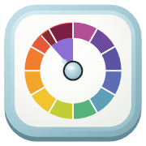
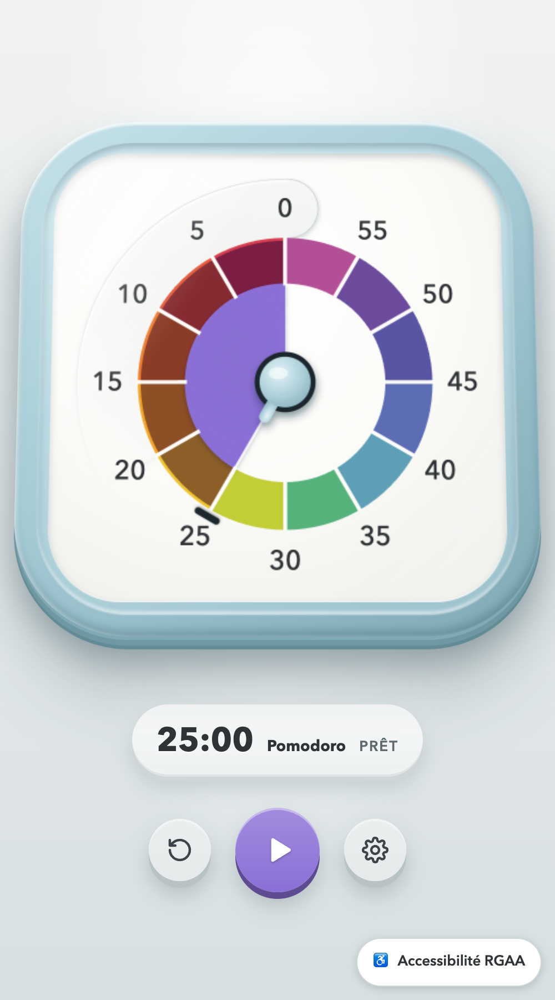
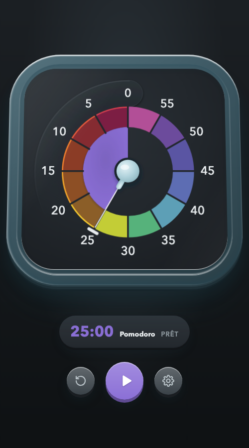
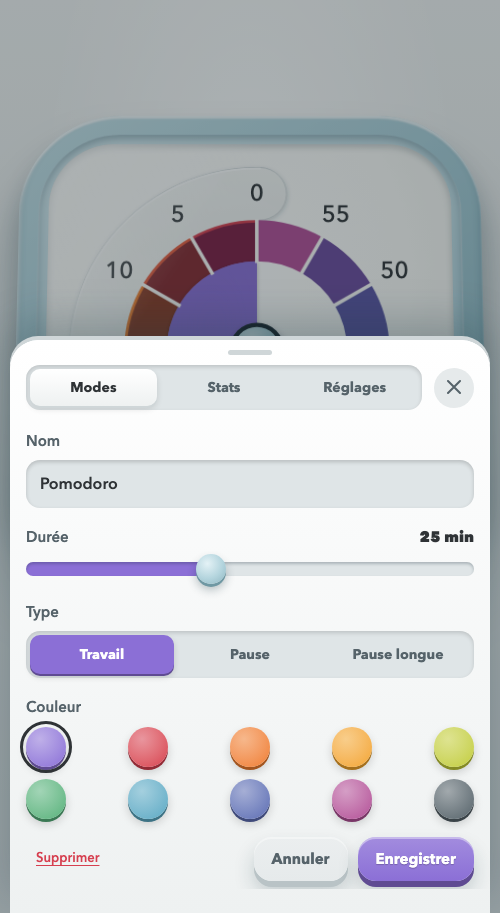
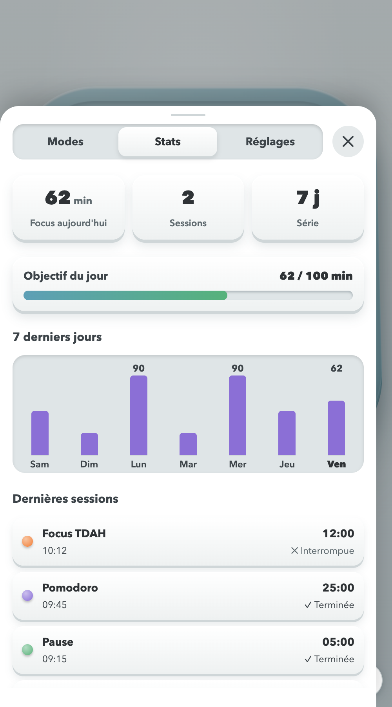

[🇫🇷 Français](README.md) · 🇬🇧 English

# Pomodoro Accessibilité

**A visual timer for autism, ADHD, DYS disorders and other neurodivergent minds.**
You see the time that's left instead of reading it.

&nbsp;&nbsp;

---

## Contents

- [Why a visual timer?](#why-a-visual-timer)
- [What the app does](#what-the-app-does)
- [How to use it](#how-to-use-it)
- [Sounds](#sounds)
- [Accessibility](#accessibility)
- [For developers](#for-developers)

## Why a visual timer?

A clock tells the time and a digital timer shows numbers, but neither really **shows** time.
Pomodoro Accessibilité follows the visual timer principle: a colored disc covers the chosen duration
and **shrinks as time goes by**. At a glance, you know whether there's a lot or a little time
left, without reading or calculating anything.

This concrete cue is especially helpful for people who are **ADHD, autistic or neurodivergent**:

- 🧭 **Make time concrete**: an abstract duration becomes a surface that shrinks.
- 🔄 **Ease transitions**: sounds at 45, 30 and 15 min, then a closing chime, gently warn that
  a change of activity is coming.
- 🌱 **Encourage autonomy**: you manage your own work or break time, with no adult or
  colleague needing to remind you.
- 🏠 **Every day**: homework, morning routines, screen time, Pomodoro work sessions, at home,
  in class or at the office.

### Neurodiversity: a few definitions

- **Neurodivergent**: a person whose neurological functioning diverges from societal norms. An autistic person, or someone with ADHD or dyslexia, is considered neurodivergent.
- **Neurotypical**: a person whose neurological functioning matches the dominant norms of society.

The concept of neurodiversity thus includes the idea that some brains perceive and understand the world differently, and that their strengths should also be recognized: creativity, branching thinking, systems thinking, perseverance, honesty.

### Time is hard to feel

For many neurodivergent people, time does not "feel" like anything: ten minutes and an hour can
seem the same, and looking at a clock does not always tell how much is left. This is not a
lack of willpower or a bad mood; it is a different way of perceiving duration. A shrinking
disc replaces a calculation with an image.

| Profile               | Common difficulty                                                       | What the app offers                                                                |
| --------------------- | ----------------------------------------------------------------------- | ---------------------------------------------------------------------------------- |
| **ADHD**              | Estimating duration, starting, stopping on time                         | A visual cue, short sessions followed by breaks, a *Focus TDAH* mode               |
| **Autism**            | Switching activities, coping with the unexpected and with noise         | Milestones announced in advance, soft sounds that can be turned off, a stable interface |
| **DYS disorders**     | Reading numbers or a clock time, tiring quickly on text                 | Time you can read without numbers, the OpenDyslexic font, well-spaced text         |
| **Other profiles**    | Need for clear instructions, an adapted pace, less pressure             | Free durations from 1 to 60 min, custom modes, no grades or penalties              |

### A tool without pressure

- **No judgment**: no punitive score; the daily goal is a target, not an obligation.
- **A gentle ending**: at 0, five more minutes can be added to finish without being rushed.
- **The person stays in control**: sounds, vibration and the always-on screen can be turned off or adjusted.
- **A calm display**: no flashing, reduced animations if the device asks for it.

### In the workplace too

Neurodiversity concerns teams as well: creativity, branching thinking, perseverance and rigor
are recognized strengths, provided the work environment does not add needless obstacles. A
visual timer is a simple, discreet and free tool at that level.

- 🎯 **Focus sessions**: split a task into Pomodoro blocks with breaks, without depending on a
  colleague's or manager's watchful eye.
- 🔄 **Switching tasks**: the 45, 30 and 15 min milestones help wrap up and change topic
  without an abrupt cut.
- 🤝 **Meetings and interviews**: keep a duration visible to everyone, which reassures and
  frames the exchange.
- 🎧 **Office or remote work**: discreet vibration and notifications, sounds that can be
  turned off in an open space.
- 🧰 **A simple accommodation**: to offer alongside other workplace adjustments, without
  singling anyone out, since the tool is useful to everyone.

> [!NOTE]
> Independent project, inspired by the visual timer principle. It is neither affiliated with
> nor endorsed by Time Timer®, a registered trademark of its owner.

## What the app does

|                                 |                                                                                                                        |
| ------------------------------- | ---------------------------------------------------------------------------------------------------------------------- |
| 🕒 **A dial that empties**       | A colored disc shrinks toward 0, with a rainbow ring of 12 five-minute segments, up to 60 min                          |
| 👆 **Set it with your finger**   | Just drag on the dial to choose the minutes, even while the countdown is running                                       |
| 🎯 **Custom modes**              | Pomodoro, Break, Long break, ADHD Focus… or your own modes: name, duration (1-60 min), color, work or break            |
| 🔁 **Automatic chaining**        | Work → break → work, with a long break every 4 cycles (can be turned off)                                              |
| 📊 **History & statistics**      | Focus time today, completed sessions, day streak, chart of the last 7 days                                             |
| 🏁 **Daily goal**                | A number of focus minutes to aim for each day (10-300 min), with a progress bar                                        |
| 🔔 **Milestone sounds**          | A different sound at 45, 30 and 15 min left, then a chime at the end                                                   |
| ⏱️ **Automatic +5 min**          | At 0, five more minutes to finish what you're doing (can be turned off)                                                |
| 📳 **Vibration**                 | A light tap at the end and while adjusting                                                                             |
| 📲 **Notifications**             | Alerts even with a locked phone or the app in the background, with the same sounds as the app                          |
| 🔆 **Screen always on**          | The screen doesn't turn off during the countdown (can be turned off)                                                   |
| 🧩 **iPhone widget**             | The running countdown or today's goal, right on your home screen                                                       |
| 🌍 **7 languages**               | French, English, Spanish, German, Italian, Portuguese, Arabic (read right to left)                                     |
| 🌗 **Dark mode**                 | Follows your device setting, then adjustable in ⚙︎                                                                      |
| 🔇 **Sound on/off**              | Mute everything, and the choice is remembered                                                                          |

The countdown stays accurate even if the app goes to the background or the phone locks:
when you come back, everything is up to date.

## How to use it

| Gesture                    | Action                                                                        |
| -------------------------- | ----------------------------------------------------------------------------- |
| **Tap** the dial or ▶      | Start, pause or resume                                                        |
| **Drag** on the dial       | Set the minutes (0 → 60)                                                      |
| ↺                          | Reset                                                                         |
| ⚙︎ → **Modes**              | Choose, create, edit or delete a mode                                         |
| ⚙︎ → **Stats**              | See today's goal, your statistics and session history                         |
| ⚙︎ → **Settings**           | Dark mode, sounds, +5 min, chaining, screen on, goal, language                |

  
  &nbsp;&nbsp;
  

## Sounds

They go from the gentlest to the most insistent as the end approaches, and you can listen to
them in ⚙︎ → *Listen to sounds*.

| Moment               | Sound                                               |
| -------------------- | --------------------------------------------------- |
| **45 min** left      | 1 soft, round note                                  |
| **30 min**           | 2 rising notes, a bit brighter                      |
| **15 min**           | 3 quick notes, "beep" style                         |
| **0**                | A chime played 3 times, with vibration              |

## Accessibility

The app is designed to be usable by everyone:

- 💻 **Keyboard only**: everything works without a mouse, with a visible marker on the active element.
- 🔊 **With a screen reader**: the remaining time and changes are announced aloud.
- 👁️ **Readable for all**: careful contrast, dark mode, colors always paired with a name.
- 🔤 **Dyslexia-friendly font**: the OpenDyslexic font can be turned on in the settings.
- 🌀 **Reduced motion**: if your device asks for less motion, the app respects it.

A dedicated page covers all of this, including the RGAA 4.1 accessibility statement
(conformance status, non-accessible content, contact and remedies): see the
**♿ Accessibility** link at the bottom right of the app.

These guarantees are checked on every change: `npm run test:a11y` replays sixteen checks
(axe-core on every view, in light, dark and Arabic; keyboard control of the dial; the modal
focus trap; no horizontal scrolling at 320 px), and CI runs them on every push.

## For developers

The technical documentation is in French:

- [Installation and commands](docs/INSTALLATION.md)
- [Mobile build (iOS / Android), notifications and widget](docs/MOBILE.md)
- [Code architecture](docs/ARCHITECTURE.md)
- [Functional specification (French)](docs/FUNCTIONAL-SPECIFICATION.md)
- [Technical specification (French)](docs/TECHNICAL-SPECIFICATION.md)
