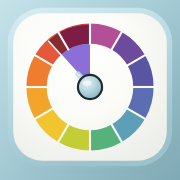
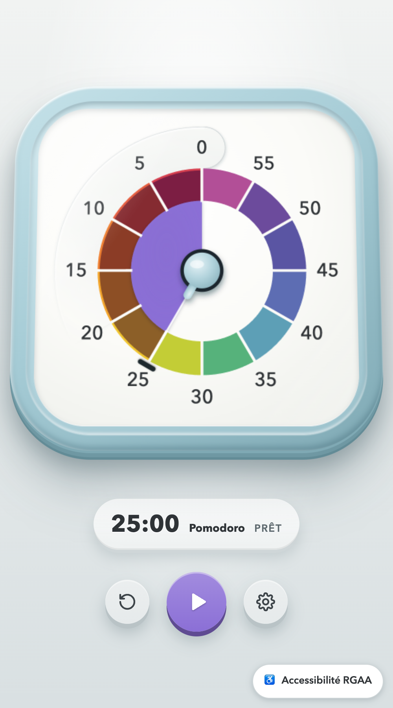
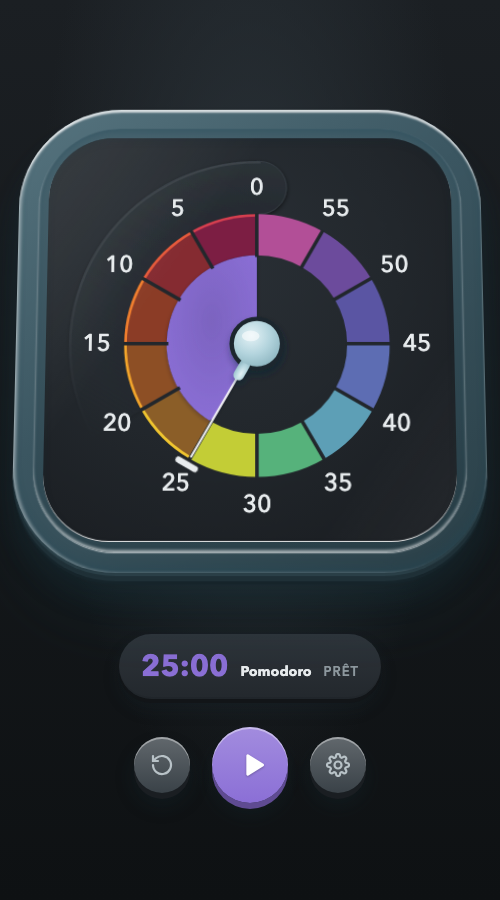
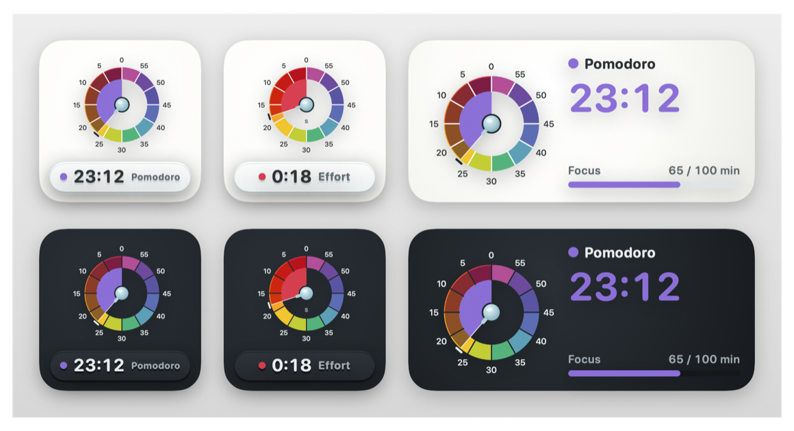
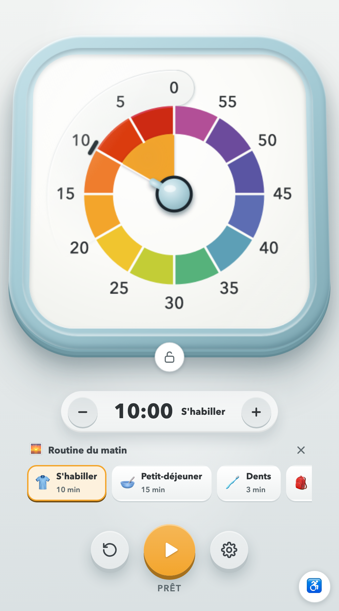
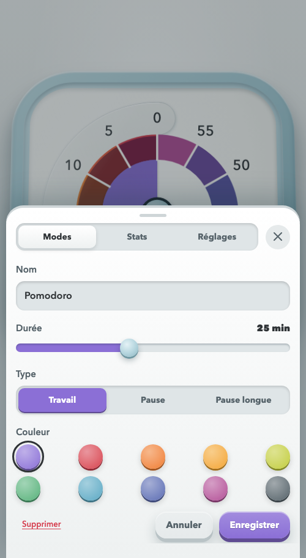
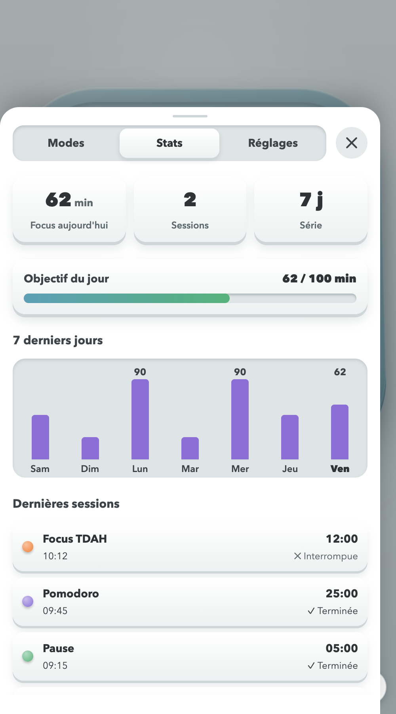

[🇫🇷 Français](README.md) · 🇬🇧 English

# Pomodoro Accessibilité

**A visual timer for autism, ADHD, DYS disorders and other neurodivergent minds.**
You see the time that's left instead of reading it.

&nbsp;&nbsp;

---

## Contents

- [Why a visual timer?](#why-a-visual-timer)
- [What the app does](#what-the-app-does)
- [How to use it](#how-to-use-it)
- [Sounds](#sounds)
- [Accessibility](#accessibility)
- [For developers](#for-developers)

## Why a visual timer?

A clock tells the time and a digital timer shows numbers, but neither really **shows** time.
Pomodoro Accessibilité follows the visual timer principle: a colored disc covers the chosen duration
and **shrinks as time goes by**. At a glance, you know whether there's a lot or a little time
left, without reading or calculating anything.

This concrete cue is especially helpful for people who are **ADHD, autistic or neurodivergent**:

- 🧭 **Make time concrete**: an abstract duration becomes a surface that shrinks.
- 🔄 **Ease transitions**: three milestones announced before the end, worked out from the chosen
  duration, then a closing chime: you know a change of activity is coming.
- 🌱 **Encourage autonomy**: you manage your own work or break time, with no adult or
  colleague needing to remind you.
- ⏰ **No need to remember**: a routine can remind you of itself, at the time and on the days
  you choose — not noticing that it is time is precisely the difficulty.
- 🏠 **Every day**: homework, morning routines, screen time, Pomodoro work sessions, at home,
  in class or at the office.

### Neurodiversity: a few definitions

- **Neurodivergent**: a person whose neurological functioning diverges from societal norms. An autistic person, or someone with ADHD or dyslexia, is considered neurodivergent.
- **Neurotypical**: a person whose neurological functioning matches the dominant norms of society.

The concept of neurodiversity thus includes the idea that some brains perceive and understand the world differently, and that their strengths should also be recognized: creativity, branching thinking, systems thinking, perseverance, honesty.

### Time is hard to feel

For many neurodivergent people, time does not "feel" like anything: ten minutes and an hour can
seem the same, and looking at a clock does not always tell how much is left. This is not a
lack of willpower or a bad mood; it is a different way of perceiving duration. A shrinking
disc replaces a calculation with an image.

| Profile               | Common difficulty                                                       | What the app offers                                                                |
| --------------------- | ----------------------------------------------------------------------- | ---------------------------------------------------------------------------------- |
| **ADHD**              | Estimating duration, starting, stopping on time                         | A visual cue, short sessions followed by breaks, a *Focus TDAH* mode               |
| **Autism**            | Switching activities, coping with the unexpected and with noise         | Milestones announced in advance, routines in pictures, soft sounds that can be turned off |
| **DYS disorders**     | Reading numbers or a clock time, tiring quickly on text                 | Time you can read without numbers, the OpenDyslexic font, well-spaced text         |
| **Other profiles**    | Need for clear instructions, an adapted pace, less pressure             | Free durations from 1 to 60 min, custom modes, no grades or penalties              |

### A tool without pressure

- **No judgment**: no punitive score; the daily goal is a target, not an obligation.
- **A gentle ending**: at 0, five more minutes can be added to finish without being rushed.
- **The person stays in control**: sounds, vibration and the always-on screen can be turned off or adjusted.
- **A calm display**: no flashing, reduced animations if the device asks for it.

### In the workplace too

Neurodiversity concerns teams as well: creativity, branching thinking, perseverance and rigor
are recognized strengths, provided the work environment does not add needless obstacles. A
visual timer is a simple, discreet and free tool at that level.

- 🎯 **Focus sessions**: split a task into Pomodoro blocks with breaks, without depending on a
  colleague's or manager's watchful eye.
- 🔄 **Switching tasks**: three milestones before the end, short sessions included, help wrap
  up and change topic without an abrupt cut.
- 🤝 **Meetings and interviews**: keep a duration visible to everyone, which reassures and
  frames the exchange.
- 🎧 **Office or remote work**: discreet vibration and notifications, sounds that can be
  turned off in an open space.
- 🧰 **A simple accommodation**: to offer alongside other workplace adjustments, without
  singling anyone out, since the tool is useful to everyone.

> [!NOTE]
> Independent project, inspired by the visual timer principle. It is neither affiliated with
> nor endorsed by Time Timer®, a registered trademark of its owner.

## What the app does

|                                 |                                                                                                                        |
| ------------------------------- | ---------------------------------------------------------------------------------------------------------------------- |
| 🕒 **A dial that empties**       | A colored disc shrinks toward 0, with a rainbow ring of 12 five-minute segments, up to 60 min                          |
| 👆 **Set it with your finger**   | Just drag on the dial to choose the minutes, even while the countdown is running                                       |
| ➖➕ **− and + buttons**           | One minute per tap, no dragging: for shaky hands, a single finger or a switch device                                   |
| 🔒 **Dial lock**                 | One tap and the dial stops responding: a resting palm can no longer change the time or wipe the session               |
| 🎯 **Custom modes**              | Pomodoro, Break, Long break, ADHD Focus… or your own modes: name, duration (1-60 min), color, work or break            |
| 👋 **Welcome tutorial**          | Five views on first launch: seeing time, setting it, starting it, routines, alerts                          |
| 🧩 **Picture routines**          | A sequence of steps that follow on their own — get dressed, breakfast, teeth, school bag — each with its picture and its length |
| 🔁 **Rounds and seconds**        | A step lasts from 5 s to 60 min, a routine replays up to 20 times: "work 20 s, rest 10 s" × 8 is a Tabata |
| 💪 **Dial in seconds**           | Below a minute the graduation counts seconds — a 20 s effort drains before your eyes instead of being a sliver |
| 3️⃣ **Last three counted down**   | A tick, a pulse and a flash each second, and what comes next announced before the end |
| 🎨 **Workout mode**              | A routine marked *workout* tints the whole page with the step's colour — red for work, green for rest |
| ⏰ **Routine reminder**          | A time, some days: the notification arrives when it should and opens the routine, ready to start                               |
| 🧪 **Notification test**         | A button schedules a notification five seconds out: time enough to lock the screen, and to know the device warns you before you need it |
| 🔁 **Automatic chaining**        | Work → break → work, with a long break every 4 cycles (can be turned off)                                              |
| 📊 **History & statistics**      | Focus time today, completed sessions, day streak, chart of the last 7 days                                             |
| 🏁 **Daily goal**                | A number of focus minutes to aim for each day (10-300 min), with a progress bar                                        |
| 🔔 **Milestone sounds**          | Three milestones before the end, worked out from the set duration, each with its own sound, then a chime               |
| 💡 **Visual alert**              | A colored flash at the milestones and at the end, soft or strong, for anyone who can't hear or muted the sound        |
| 🗣️ **Spoken time**               | The time left read out loud, at the milestones or every minute, to listen instead of looking (off by default)          |
| ⏱️ **Automatic +5 min**          | At 0, five more minutes to finish what you're doing (can be turned off)                                                |
| 📳 **Coded vibration**           | A different pattern per milestone — 1 pulse on the first, 2 on the second, 3 short on the last, 3 long at the end (can be turned off) |
| 📲 **Notifications**             | Alerts even with a locked phone or the app in the background, with the same sounds as the app                          |
| 🔆 **Screen always on**          | The screen doesn't turn off during the countdown (can be turned off)                                                   |
| 🧩 **iPhone and Android widget** | The dial itself on your home screen: the disk empties minute by minute, with the time left and today's goal            |
| ⏱️ **Countdown on the lock screen** | A silent notification on Android, a Live Activity on iPhone: the time left without unlocking |
| 🍽️ **Table mode**                | The dial writ large, everything else cleared away: a phone stood on a desk becomes the timer for the table or the classroom |
| 🌍 **7 languages**               | French, English, Spanish, German, Italian, Portuguese, Arabic (read right to left)                                     |
| 🌗 **Dark mode**                 | Follows your device setting, then adjustable in ⚙︎                                                                      |
| 🔇 **Sound on/off**              | Mute everything, and the choice is remembered                                                                          |

The countdown stays accurate even if the app goes to the background or the phone locks:
when you come back, everything is up to date.

## How to use it

| Gesture                    | Action                                                                        |
| -------------------------- | ----------------------------------------------------------------------------- |
| **Tap** the dial or ▶      | Start, pause or resume                                                        |
| **Drag** on the dial       | Set the minutes (0 → 60)                                                      |
| **−** / **+** under the dial | Remove or add a minute; press and hold to run through them                   |
| ↺                          | Reset                                                                         |
| ⚙︎ → **Modes**              | Choose, create, edit or delete a mode                                         |
| ⚙︎ → **Modes** → *Routines* | Start a routine, create one, reorder its steps                                |
| ⚙︎ → **Modes** → ✎ → *Rounds* | Replay the steps: eight rounds for a Tabata                                 |
| ⚙︎ → **Modes** → ✎ → *Reminder* | Set the time and the days when the routine comes to remind you            |
| **Tap** a step             | Jump straight to that step of the routine; ✕ leaves the routine               |
| ⚙︎ → **Stats**              | See today's goal, your statistics and session history                         |
| ⚙︎ → **Settings** → *Play the tutorial again* | Replay the five welcome views                               |
| ⚙︎ → **Settings**           | Dark mode, sounds, vibration, visual alert, spoken time, +5 min, chaining, screen on, goal, language |

  
  &nbsp;&nbsp;
  
  &nbsp;&nbsp;
  

## Sounds

They go from the gentlest to the most insistent as the end approaches, and you can listen to
them in ⚙︎ → *Listen to sounds*.

| Moment               | Sound                                               | Vibration                        |
| -------------------- | --------------------------------------------------- | -------------------------------- |
| **1st milestone**    | 1 soft, round note                                  | 1 long pulse                     |
| **2nd milestone**    | 2 rising notes, a bit brighter                      | 2 pulses                         |
| **Last milestone**   | 3 quick notes, "beep" style                         | 3 short pulses                   |
| **0**                | A chime played 3 times                              | 3 long pulses                    |

Milestones land at 45, 30 and 15 min left on a session longer than 40 min. Below that they are
worked out from the chosen duration — halfway, the last quarter, then 1 min before the end —
otherwise a 25 min Pomodoro would only be warned once, and a 10 min routine step never.

All four come out at the same volume, close to the maximum: what rises from one milestone to the
next is the pattern and the timbre, not the level. A quiet first milestone would be a missed one.

⚠️ **On Android, two volume sliders are involved**: the sounds the app itself plays follow the
**media** volume, while notification sounds (locked screen, app in the background) follow the
**notification** volume. If the sounds seem weak during a session, media is the one to turn up —
the system picks the slider, not the app.

The vibration follows the same rhythm as the sound: it warns you without showing or playing
anything — in a meeting, in class, in an open space — and it is the only alert channel left for
a deafblind person. It needs a phone or a tablet (iOS and Android; on the web, only Android
vibrates).

## Accessibility

The app is designed to be usable by everyone:

- 💻 **Keyboard only**: everything works without a mouse, with a visible marker on the active element.
- 🔊 **With a screen reader**: the remaining time and changes are announced aloud.
- 💡 **Without sound**: a colored flash marks the milestones and the end, and a "Time's up" banner
  stays until the next action. The pulse is slow — one 1.6 s beat, that is 0.6 Hz, five times below
  the three-flashes-per-second threshold that can trigger a photosensitive seizure (WCAG 2.3.1) —
  and it holds still if your device asks for less motion.
- 🗣️ **Without looking at the dial**: spoken time reads the minutes left at the milestones or every
  minute, with the device voice, offline (⚙︎ → *Spoken time*).
- 📳 **Without seeing or hearing**: every milestone has its own vibration pattern, recognizable in
  your hand (⚙︎ → *Vibration*).
- 👁️ **Readable for all**: careful contrast, dark mode, colors always paired with a name.
- 🖼️ **Without reading**: every step of a routine carries a picture before its name, and the strip
  shows what is done, what is playing and what comes next.
- 🔤 **Dyslexia-friendly font**: the OpenDyslexic font can be turned on in the settings.
- 🌀 **Reduced motion**: if your device asks for less motion, the app respects it.
- 🖐️ **No dragging required**: the − and + buttons set the duration with a single tap, for anyone
  who cannot hold a drag (WCAG 2.5.7), with targets of at least 44 px.
- 🔒 **Against accidental touches**: the lock neutralizes the dial, the − / + buttons and the reset.
  Start / Pause stays live: an accidental pause costs nothing, an accidental reset loses the session.

A dedicated page covers all of this, including the RGAA 4.1 accessibility statement laid out as
French decree no. 2019-768 requires (commitment, conformance status, test results, non-accessible
content, how the statement was drawn up, contact and remedies): see the **♿ Accessibility** link
at the bottom right of the app. The status is **partially conformant**, with no conformance
score: no third party has audited the app, and a self-awarded percentage would mislead. The
statement is published voluntarily — the app falls outside the scope of article 47 of French law
no. 2005-102.

These guarantees are checked on every change: `npm run test:a11y` replays seventy-two checks
(axe-core on every view, in light, dark and Arabic; control of the dial by keyboard and by the
− / + buttons; spoken time, vibration patterns and the visual alert checked against a simulated
countdown, a short session's milestones included; the dial in seconds, the last three seconds
counted down and rounds chaining; the welcome tutorial by keyboard, in Arabic and with no
focus escape; the dial lock; the chaining of a routine's steps, its strip and its editor; target
sizes; the modal focus trap; no horizontal scrolling at 320 px), and CI runs them on every push.

## For developers

The technical documentation is in French:

- [Installation and commands](docs/INSTALLATION.md)
- [Mobile build (iOS / Android), notifications and widget](docs/MOBILE.md)
- [Code architecture](docs/ARCHITECTURE.md)
- [Functional specification (French)](docs/FUNCTIONAL-SPECIFICATION.md)
- [Technical specification (French)](docs/TECHNICAL-SPECIFICATION.md)
